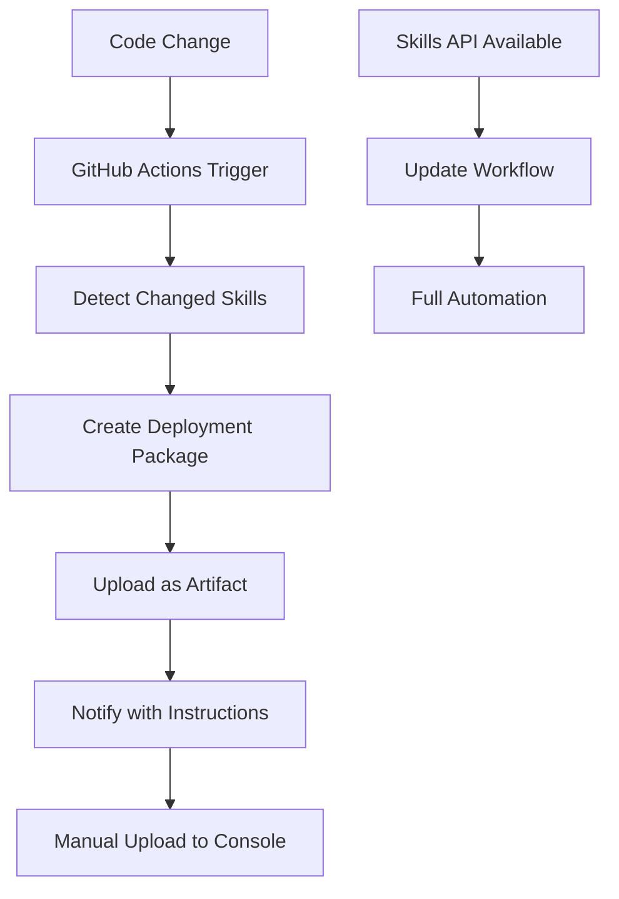

# Skills Deployment Automation

This repository automatically prepares Claude skills for deployment when changes are made. Until the Anthropic Skills API supports programmatic uploads, the system creates deployment packages for manual upload to Claude Console.

## 🚀 How It Works

### Automatic Trigger
1. **Push to main** that changes `skills/grammar/` or `skills/sermon-writer/` folders
2. **GitHub Actions detects** which skills changed
3. **Deployment packages created** with versioned zip files
4. **Notification sent** with upload instructions

### Manual Trigger
1. Go to **Actions** tab in GitHub
2. Select **"Prepare Skills for Claude Console"**
3. Click **"Run workflow"**
4. Choose which skill(s) to prepare
5. **Download artifacts** and upload manually

## 📦 Deployment Packages

Each deployment includes:
- **Versioned zip file** (e.g., `grammar-v1.2.3.zip`)
- **Metadata file** with upload instructions
- **GitHub artifact** for easy download

## 🔧 Setup Instructions

### 1. Repository Variables (Optional)
Add these to **Settings → Secrets and variables → Actions → Variables**:
- `GRAMMAR_SKILL_ID` - skill_01LEoRLHpcopdFfXjv9gj9hj
- `SERMON_WRITER_SKILL_ID` - skill_017hvH95CWyhykzXbG542B3B

*If not set, defaults are used from the workflow*

### 2. Test the Automation

**Option A:** Make a test commit
```bash
cd skills/grammar
echo "# Test change" >> SKILL.md
git add SKILL.md
git commit -m "test: trigger deployment automation"
git push origin main
```

**Option B:** Manual trigger
1. Go to **Actions** tab
2. Select **"Prepare Skills for Claude Console"**
3. Click **"Run workflow"**
4. Choose **"all"** or specific skill
5. Click **"Run workflow"**

### 3. Monitor Deployments
- Check **Actions** tab for status
- View **deployment summary** in workflow results
- Download **artifacts** for manual upload

## 📋 Manual Upload Process

### When Workflow Completes:
1. **Download artifacts** from Actions tab
2. **Extract zip files** from downloaded artifacts
3. **Go to Claude Console**: https://console.anthropic.com/skills
4. **Find your skill** (grammar or sermon-writer)
5. **Upload new version** using the zip file
6. **Activate** the new version

### Upload Instructions Example:
```
Skill: grammar
Version: v1.2.3
File: grammar-v1.2.3.zip
Console: https://console.anthropic.com/skills
Skill ID: skill_01LEoRLHpcopdFfXjv9gj9hj
```

## 🔄 Versioning Strategy

### Automatic Versioning
- **Tagged releases**: `v1.0.0`, `v1.1.0`, etc.
- **Commit-based**: `a1b2c3d` (short SHA)
- **Dirty builds**: `a1b2c3d-dirty`

### Create Version Tags
```bash
# After validating changes
git tag -a v1.0.0 -m "Grammar skill v1.0.0 - production ready"
git push origin v1.0.0

# Trigger deployment with version tag
git push origin main
```

## 🚀 Future: Full Automation

When Anthropic releases Skills API upload support:

### Quick Migration
1. **Replace** `prepare-skill.py` calls with `upload-skill.py`
2. **Add API secrets** to GitHub repository
3. **Update workflow** to use upload script
4. **Enable full automation**!

### Ready-to-Go Scripts
- ✅ `scripts/upload-skill.py` - Full upload automation
- ✅ `scripts/test-skills-api.py` - API connectivity test  
- ✅ `scripts/prepare-skill.py` - Current deployment prep

## 📊 Workflow Summary



## 🛠️ Local Testing

### Test Deployment Package Creation
```bash
# Install dependencies
pip install -r scripts/requirements.txt

# Test grammar skill
python scripts/prepare-skill.py \
  --skill-path skills/grammar \
  --skill-id skill_01LEoRLHpcopdFfXjv9gj9hj \
  --version $(git describe --tags --always) \
  --output-dir deployments

# Test sermon-writer skill  
python scripts/prepare-skill.py \
  --skill-path skills/sermon-writer \
  --skill-id skill_017hvH95CWyhykzXbG542B3B \
  --version $(git describe --tags --always) \
  --output-dir deployments
```

### Test API Connectivity
```bash
# Test Skills API access
python scripts/test-skills-api.py

# Expected output: List of existing skills
```

## ❌ Troubleshooting

### No Deployment Triggered
- ✅ Check files changed are in `skills/grammar/` or `skills/sermon-writer/`
- ✅ Verify workflow file syntax
- ✅ Check Actions tab for errors

### Deployment Package Failed
- ✅ Verify `SKILL.md` exists in skill folder
- ✅ Check Python dependencies are installed
- ✅ Review workflow logs for specific errors

### Manual Upload Issues
- ✅ Verify skill ID matches Claude Console
- ✅ Check zip file is not corrupted
- ✅ Ensure you have access to the skill in console

## 📖 References

- **Claude Skills**: https://console.anthropic.com/skills
- **Skills Documentation**: https://docs.claude.com/en/api/skills-guide
- **Repository Structure**: [skills/README.md](../skills/README.md)
- **Automation Plan**: [Automated_Upload_Plan.md](../Automated_Upload_Plan.md)